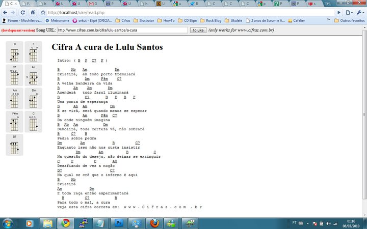
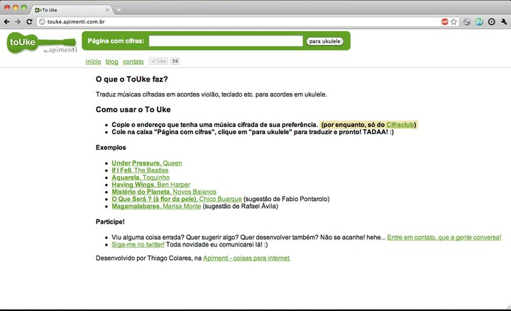
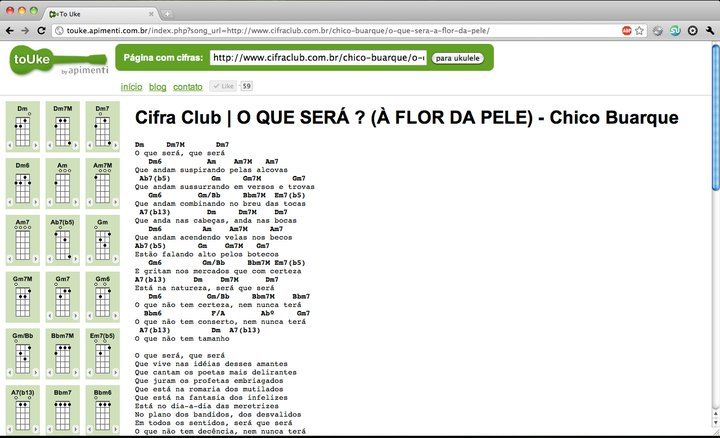
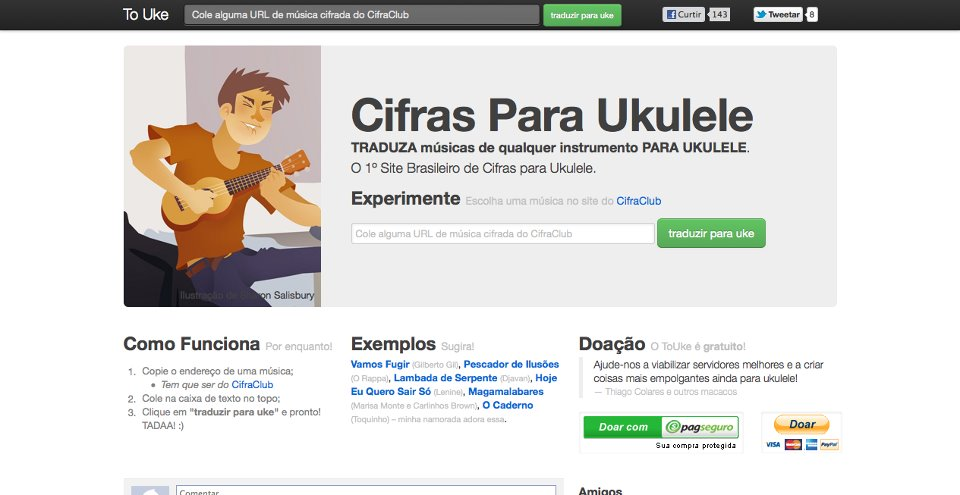
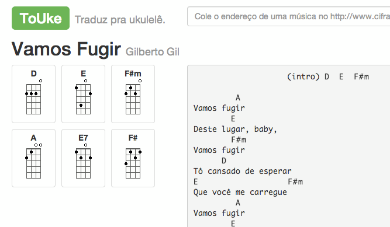

ToUke
==========

Translates any music sheet chords (from www.cifraclub.com.br) from any instrument to ukulele. This is the first step from a lot of other possibilities we want to achieve and build with a FLOSS (Free/Libre and Open Source Software) version of a chords / tab full site.

#### Ukulele
The ukulele ([ˈʔukuˈlɛlɛ], oo-koo-le-le) is a Hawaiian member of the guitar family of instruments; it generally employs four nylon or gut strings or four courses of strings and originated in the 19th century. [Find more about Ukulele at Wikipedia.
](http://en.wikipedia.org/wiki/Ukulele)

Timeline / Archive
===============
**This project has been discontinued and deactivated on 2014!** But you can you the code at your will being aware of the license.

### First version

Made on a Sunday night on March 3rd, 2010.

### First home

First home, with a fancy logo :)

### Complex songs

Started to parse complex chords and it's variations. Listen to ["O que será" on YouTube](https://www.youtube.com/watch?v=yIERqgKooiU). This is such a fascinating brazilian song. 

### Second home and logs

New pretty home :) Recognized more and chords. And started mapping not found chords. 

### Responsive interface

Responsive interface. Listen to [Vamos fugir on YouTube](https://www.youtube.com/watch?v=sxmjMwmC8Us). Gilberto Gil is a genius. 

Why touke-flow?
===============

The touke-flow project is the new version of ToUke, now completely reimplemented using [TYPO3 Flow](http://flow.typo3.org) framework. The [old version](https://github.com/colares/touke) uses the CakePHP framework.

Collaborate
==========

There are so many ways to show your love for ToUke:

* [Donate for hosting](http://www.dreamhost.com/donate.cgi?id=17000)
* [Improve the code](https://github.com/colares/touke-flow/)
* [Report bugs or share new ideas](https://trello.com/b/Ua7WQffq/touke)
* [Participate in discussions](https://www.facebook.com/pages/ToUke/242518995758195)
* [Use ToUke and tell your friends](http://touke.dreamhosters.com/)

Licensing
=========

**ToUke is a free software**. See LICENSE for more details. You can redistribute it and/or modify it under the terms of the [GNU Affero General Public License](http://www.gnu.org/licenses/agpl.html) as published by the Free Software Foundation; either version 3 of the License, or (at your option) any later version.

